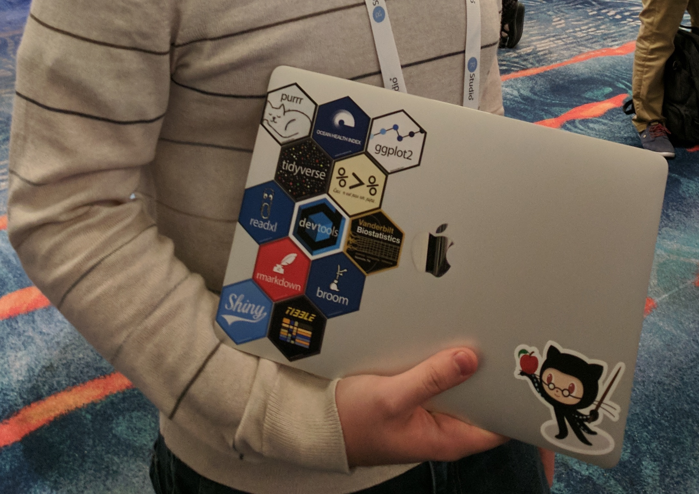
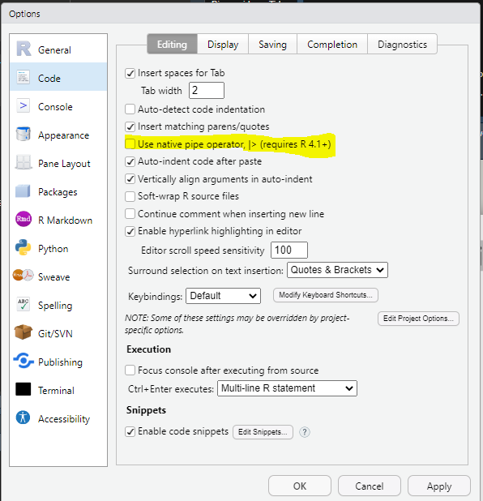
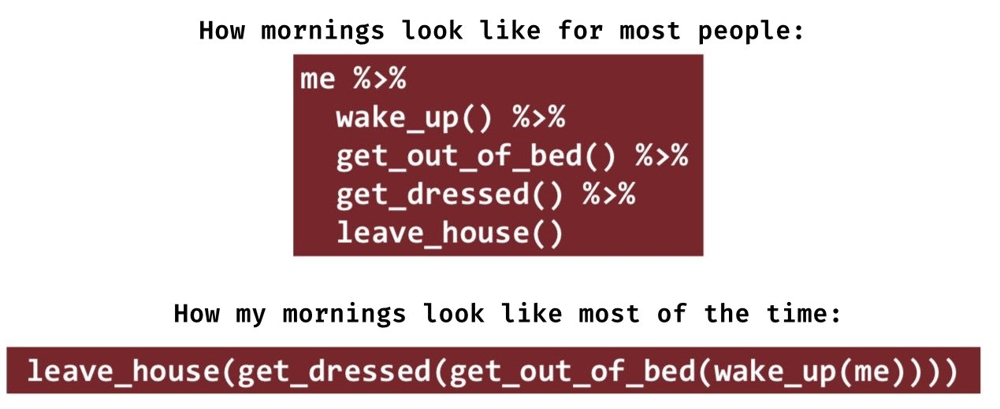

class: title-slide, middle, right 

<meta http-equiv='Content-Type' content='text/html; charset=utf-8' />

```{css hideOutput-lib-src, echo = FALSE}
<style>
/* Oculta los bloques de código con la clase 'r' */
pre.r {
  display: none !important;
}
</style>

<script>
doclick = function(e) {
  // Busca el siguiente bloque de código con la clase 'r'
  code = e.parentNode.nextSibling.nextSibling;

  if (code.style.display == "block") {
    code.style.display = 'none';
    e.textContent = "Mostrar código";
  } else {
    code.style.display = "block";
    e.textContent = "Ocultar código";
  }
}
</script>

<script>
function myFunction1() {
    var x = document.getElementById("myDIV");
    if (x.style.display === "none") {
        x.style.display = "block";
    } else {
        x.style.display = "none";
    }
}
</script>

<script>
function myFunction2() {
    var x = document.getElementById("myDIV2");
    if (x.style.display === "none") {
        x.style.display = "block";
    } else {
        x.style.display = "none";
    }
}
</script>
```
```{css, echo = F}
/* -------------------------------------------------------
 *
 *     !! This file was generated by xaringanthemer !!
 *
 *  Changes made to this file directly will be overwritten
 *  if you used xaringanthemer in your xaringan slides Rmd
 *
 *  Issues or likes?
 *    - https://github.com/gadenbuie/xaringanthemer
 *    - https://www.garrickadenbuie.com
 *
 *  Need help? Try:
 *    - vignette(package = "xaringanthemer")
 *    - ?xaringanthemer::style_xaringan
 *    - xaringan wiki: https://github.com/yihui/xaringan/wiki
 *    - remarkjs wiki: https://github.com/gnab/remark/wiki
 *
 *  Version: 0.4.1
 *
 * ------------------------------------------------------- */
@import url(https://fonts.googleapis.com/css?family=Lato:400,400i&display=swap);
@import url(https://fonts.googleapis.com/css?family=Lato&display=swap);
@import url(https://fonts.googleapis.com/css?family=Lato&display=swap);
@import url(https://fonts.googleapis.com/css?family=Arial+Narrow&display=swap);

:root {
  /* Fonts */
  --text-font-family: Lato;
  --text-font-is-google: 1;
  --text-font-family-fallback: -apple-system, BlinkMacSystemFont, avenir next, avenir, helvetica neue, helvetica, Ubuntu, roboto, noto, segoe ui, arial;
  --text-font-base: sans-serif;
  --header-font-family: Lato;
  --header-font-is-google: 1;
  --header-font-family-fallback: Georgia, serif;
  --code-font-family: Lato;
  --code-font-is-google: 1;
  --base-font-size: 20px;
  --text-font-size: 1rem;
  --code-font-size: 53%;
  --code-inline-font-size: 1em;
  --header-h1-font-size: 2.75rem;
  --header-h2-font-size: 2.25rem;
  --header-h3-font-size: 1.75rem;

  /* Colors */
  --text-color: #333333;
  --header-color: #DD3333;
  --background-color: #FFFFFF;
  --link-color: #DD3333;
  --text-bold-color: #FF5252;
  --code-highlight-color: rgba(255,255,0,0.5);
  --inverse-text-color: #FFFFFF;
  --inverse-background-color: #DD3333;
  --inverse-header-color: #FFFFFF;
  --inverse-link-color: #DD3333;
  --title-slide-background-color: #FFFFFF;
  --title-slide-text-color: #DD3333;
  --header-background-color: #DD3333;
  --header-background-text-color: #FFFFFF;
  --primary: #FFFFFF;
  --secondary: #DD3333;
}

html {
  font-size: var(--base-font-size);
}

body {
  font-family: var(--text-font-family), var(--text-font-family-fallback), var(--text-font-base);
  font-weight: 400;
  color: var(--text-color);
}
h1, h2, h3 {
  font-family: var(--header-font-family), var(--header-font-family-fallback);
  font-weight: 600;
  color: var(--header-color);
}
.remark-slide-content {
  background-color: var(--background-color);
  font-size: 1rem;
  padding: 0.4em 2.4em 0.4em 2.4em;
  width: 100%;
  height: 100%;
}
.remark-slide-content h1 {
  font-size: var(--header-h1-font-size);
}
.remark-slide-content h2 {
  font-size: var(--header-h2-font-size);
}
.remark-slide-content h3 {
  font-size: var(--header-h3-font-size);
}
.remark-code, .remark-inline-code {
  font-family: var(--code-font-family), Menlo, Consolas, Monaco, Liberation Mono, Lucida Console, monospace;
}
.remark-code {
  font-size: var(--code-font-size);
}
.remark-inline-code {
  font-size: var(--code-inline-font-size);
  color: #DD3333;
}
.remark-slide-number {
  color: #333333;
  opacity: 1;
  font-size: 0.9rem;
}
strong {
  font-weight: bold;
  color: var(--text-bold-color);
}
a, a > code {
  color: var(--link-color);
  text-decoration: none;
}
.footnote {
  position: absolute;
  bottom: 60px;
  padding-right: 4em;
  font-size: 0.9em;
}
.remark-code-line-highlighted {
  background-color: var(--code-highlight-color);
}
.inverse {
  background-color: var(--inverse-background-color);
  color: var(--inverse-text-color);
  
}
.inverse h1, .inverse h2, .inverse h3 {
  color: var(--inverse-header-color);
}
.inverse a, .inverse a > code {
  color: var(--inverse-link-color);
}
.title-slide, .title-slide h1, .title-slide h2, .title-slide h3 {
  color: var(--title-slide-text-color);
}
.title-slide {
  background-color: var(--title-slide-background-color);
}
.title-slide .remark-slide-number {
  display: none;
}
/* Two-column layout */
.left-column {
  width: 20%;
  height: 92%;
  float: left;
}
.left-column h2, .left-column h3 {
  color: #DD333399;
}
.left-column h2:last-of-type, .left-column h3:last-child {
  color: #DD3333;
}
.right-column {
  width: 75%;
  float: right;
  padding-top: 1em;
}
.pull-left {
  float: left;
  width: 47%;
}
.pull-right {
  float: right;
  width: 47%;
}
.pull-right + * {
  clear: both;
}
img, video, iframe {
  max-width: 100%;
}
blockquote {
  border-left: solid 5px #DD333380;
  padding-left: 1em;
}
.remark-slide table {
  margin: auto;
  border-top: 1px solid #666;
  border-bottom: 1px solid #666;
}
.remark-slide table thead th {
  border-bottom: 1px solid #ddd;
}
th, td {
  padding: 5px;
}
.remark-slide thead, .remark-slide tfoot, .remark-slide tr:nth-child(even) {
  background: #FFFFFF;
}
table.dataTable tbody {
  background-color: var(--background-color);
  color: var(--text-color);
}
table.dataTable.display tbody tr.odd {
  background-color: var(--background-color);
}
table.dataTable.display tbody tr.even {
  background-color: #FFFFFF;
}
table.dataTable.hover tbody tr:hover, table.dataTable.display tbody tr:hover {
  background-color: rgba(255, 255, 255, 0.5);
}
.dataTables_wrapper .dataTables_length, .dataTables_wrapper .dataTables_filter, .dataTables_wrapper .dataTables_info, .dataTables_wrapper .dataTables_processing, .dataTables_wrapper .dataTables_paginate {
  color: var(--text-color);
}
.dataTables_wrapper .dataTables_paginate .paginate_button {
  color: var(--text-color) !important;
}

/* Horizontal alignment of code blocks */
.remark-slide-content.left pre,
.remark-slide-content.center pre,
.remark-slide-content.right pre {
  text-align: start;
  width: max-content;
  max-width: 100%;
}
.remark-slide-content.left pre,
.remark-slide-content.right pre {
  min-width: 50%;
  min-width: min(40ch, 100%);
}
.remark-slide-content.center pre {
  min-width: 66%;
  min-width: min(50ch, 100%);
}
.remark-slide-content.left pre {
  margin-left: unset;
  margin-right: auto;
}
.remark-slide-content.center pre {
  margin-left: auto;
  margin-right: auto;
}
.remark-slide-content.right pre {
  margin-left: auto;
  margin-right: unset;
}

/* Slide Header Background for h1 elements */
.remark-slide-content.header_background > h1 {
  display: block;
  position: absolute;
  top: 0;
  left: 0;
  width: 100%;
  background: var(--header-background-color);
  color: var(--header-background-text-color);
  padding: 2rem 2.4em 1.5rem 2.4em;
  margin-top: 0;
  box-sizing: border-box;
}
.remark-slide-content.header_background {
  padding-top: 7rem;
}

@page { margin: 0; }
@media print {
  .remark-slide-scaler {
    width: 100% !important;
    height: 100% !important;
    transform: scale(1) !important;
    top: 0 !important;
    left: 0 !important;
  }
}

.primary {
  color: var(--primary);
}
.bg-primary {
  background-color: var(--primary);
}
.secondary {
  color: var(--secondary);
}
.bg-secondary {
  background-color: var(--secondary);
}

/* Extra CSS */
.remark-slide-scaler {
  overflow-y: auto;
}
.gray {
  color: #aaaaaa;
}
.black {
  color: #bc7777;
}
.darkgreen {
  color: #45503B;
}
.darkred {
  color: #591F0A;
}
.small {
  font-size: 90%;
}
.pull_c {
  float: center;
  width: 30%;
  height: 50%;
  padding-left: 40%;
}
.pull_c_title {
  height: 90%;
}
.pull_l_70 {
  float: left;
  width: 72%;
  font-size: 90%;
}
.pull_r_30 {
  float: right;
  width: 23%;
  font-size: 90%;
}
.pull_left {
  float: left;
  width: 47%;
  height: 100%;
  padding-right: 2%;
}
.pull_right {
  float: right;
  width: 47%;
  height: 100%;
  padding-left: 2%;
}
.small_left {
  float: left;
  width: 47%;
  height: 50%;
  padding-right: 2%;
}
.small_right {
  float: right;
  width: 47%;
  height: 50%;
  padding-left: 2%;
}
.left_code {
  float: left;
  width: 47%;
  height: 100%;
  padding-right: 2%;
  font: Roboto;
}
.code_out {
  float: right;
  width: 47%;
  height: 100%;
  padding-left: 2%;
  font: Roboto;
}
.text_180 {
  font-size: 180%;
}
.text_170 {
  font-size: 170%;
}
.text_160 {
  font-size: 160%;
}
.text_150 {
  font-size: 150%;
}
.text_140 {
  font-size: 140%;
}
.text_130 {
  font-size: 130%;
}
.text_120 {
  font-size: 120%;
}
.text_110 {
  font-size: 110%;
}
.text_110 {
  font-size: 110%;
}
.text_100 {
  font-size: 100%;
}
.code_10 {
  code-inline-font-size: 60%;
  overflow-y: scroll !important;
  overflow-x: scroll !important;
  max-height: 5vh !important;
  line-height: 0.75em;
}
.code_10_pre {
  code-inline-font-size: 60%;
  overflow-y: scroll !important;
  overflow-x: scroll !important;
  max-height: 15vh !important;
  line-height: 0.75em;
  min-height: 0.5em;
}
.code_15 {
  code-inline-font-size: 15%;
  overflow-y: scroll !important;
  overflow-x: scroll !important;
  max-height: 10vh !important;
}
.text_90 {
  font-size: 90%;
}
.text_80 {
  font-size: 80%;
}
.text_70 {
  font-size: 70%;
}
.text_65 {
  font-size: 65%;
}
.text_60 {
  font-size: 60%;
}
.text_50 {
  font-size: 50%;
}
.text_40 {
  font-size: 40%;
}
.text_30 {
  font-size: 30%;
}
.text_20 {
  font-size: 20%;
}
.line_space_15 {
  line-height: 1.5em;;
}
.line_space_13 {
  line-height: 1.3em;;
}
.line_space_11 {
  line-height: 1.1em;;
}
.line_space_15 {
  line-height: 1.5em;;
}
.line_space_09 {
  line-height: 0.9em;;
}
.line_space_07 {
  line-height: 0.7em;;
}
.line_space_05 {
  line-height: 0.5em;;
}
.largest {
  font-size: 2.488em;;
}
.larger {
  font-size: 2.074em;;
}
.large {
  font-size: 1.44em;;
}
.small {
  font-size: 0.833em;;
}
.smaller {
  font-size: 0.694em;;
}
.smallest {
  font-size: 0.579em;;
}
.limity150 {
  max-height: 150px;;
  overflow-y: auto;;
}
.tiny_text {
  font-size: 70%;
}
.large_text {
  font-size: 150%;
}
.slide_blue {
  background-color: #FEDA3F;
  color: #3C3C3B;
}
.center_image {
  margin: 0;
  position: absolute;
  top: 50%;
  left: 50%;
  -ms-transform: translate(-50%, -50%);
  transform: translate(-50%, -50%);
}
.center_left_img {
  top: 50%;
  left: 35%;
}
.center_left_image {
  margin: 0;
  position: absolute;
  top: 50%;
  left: 35%;
  -ms-transform: translate(-50%, -50%);
  transform: translate(-50%, -50%);
}
.center_down_image {
  margin: 0;
  position: absolute;
  top: 90%;
  left: 50%;
  -ms-transform: translate(-50%, -50%);
  transform: translate(-50%, -50%);
}
.center_top_image {
  margin: 0;
  position: absolute;
  top: 10%; /* Adjust to place the image at the top */
  left: 50%;
  -ms-transform: translate(-50%, -50%);
  transform: translate(-50%, -50%);
}
slides > slide {
  overflow-x: auto !important;
  overflow-y: auto !important;
}
.superbigimage {
  white-space: nowrap;
  overflow-y: scroll;
}
```

```{r setup_theme0, include = FALSE}
rm(list=ls());gc()
if(!grepl("4.4.0",R.version.string)){stop("Versión diferente (debe ser 4.4.0)")}
pacman::p_unlock(lib.loc = .libPaths()) #para no tener problemas reinstalando paquetes

if(!require(devtools)){install.packages("devtools", type = "win.binary", dependencies=T)}

options(servr.daemon = TRUE)
```

```{cat, engine.opts=list(file = "mylibs/zoom.html"), include=F}
<script src="https://lab.hakim.se/zoom-js/js/zoom.js" type="text/javascript"></script>
<script type="text/javascript">
	slideshow.on( "beforeHideSlide", function( slide ) {
		zoom.out();
	} );
	slideshow.on( "afterShowSlide", function( slide ) {
		document.querySelector( ".remark-visible" ).addEventListener( "dblclick", function( event ) {
			event.preventDefault();
			zoom.to( {element: event.target} );
		} );
	} );
</script>
```

```{r setup, include = FALSE}
#Para bajar paquetes estadísticos
source("___requirements.txt")

if(!require(rio)){install.packages("rio")}
if(!require(forcats)){install.packages("forcats")}

try(remotes::install_version("htmltools", "0.5.8"))

#ve si existe el emoticon de github, sino lo baja
test_fontawesome<- function(x="github"){
tryCatch({
  invisible(fontawesome::fa(name = x))
  return(message("fontawesome installed"))
},
# ... but if an error occurs, tell me what happened: 
error=function(error_message) {
  message("Installing fontawesome")
  icons::download_fontawesome()  
})
}

options(htmltools.preserve.raw = FALSE)


#knitr::opts_chunk$set(comment = NA) # lo saqué pa probar por si
knitr::opts_chunk$set(dpi=720)
#options(htmltools.preserve.raw = FALSE)#A recent update to rmarkdown (in version 2.6) changed how HTML widgets are included in the output file to use pandoc's raw HTML blocks. Unfortunately, this feature isn't compatible with the JavaScript markdown library used by xaringan. You can disable this feature and resolve the issue with htmlwidgets in xaringan slides by setting
#https://stackoverflow.com/questions/65766516/xaringan-presentation-not-displaying-html-widgets-even-when-knitting-provided-t/65768952#65768952


xaringanExtra::use_progress_bar(color = "#12636B", location = "top")#, height = "550px")
xaringanExtra::use_animate_css()
xaringanExtra::use_scribble() #son los lapices
xaringanExtra::use_tile_view()
xaringanExtra::use_panelset()
xaringanExtra::use_editable(expires = 1)
xaringanExtra::use_fit_screen()

#https://gist.github.com/gadenbuie/61b27108ceec6c7a55cd9966609128d7

# padding-top: 0.4em;
# padding-right: 2.4em;
# padding-bottom: 0.4em;
# padding-left: 2.4em;
invisible("https://www.youtube.com/watch?v=M3skTMQbCD0")
invisible("https://zane.lol/slides/adirondack/#39")
#https://titanwolf.org/Network/Articles/Article?AID=3896fe2c-1b3b-4ebd-9906-1f9ed1675b35#gsc.tab=0
#https://annakrystalli.me/talks/xaringan/xaringan.html#55
#https://bookdown.org/yihui/rmarkdown/some-tips.html
#https://arm.rbind.io/slides/xaringan.html#90
#https://stackoverflow.com/questions/62069400/font-size-of-figure-in-xaringan-slide-too-small
#https://irene.vrbik.ok.ubc.ca/blog/2021-07-14-xaringan-slides/

#https://evamaerey.github.io/doublecrochet/
#devtools::install_github("paulhendricks/anonymizer")
check_code <- function(expr, available){
  if(available){
    eval(parse(text = expr))
  } else {
    expr
  }
}
path2<-dirname(rstudioapi::getSourceEditorContext()$path)
#knitr::opts_chunk$set(message = FALSE,warning = FALSE, error = FALSE)

```

<br> 
 
.line_space_15[ 
## .text_80[Estadística Aplicada y <br> Procesamiento de Datos con R]
]

<br>

.line_space_11[
    
<br>

.text_70[[Código en: `r fontawesome::fa(name = "github")`](https://github.com/AGSCL/Curso_UDP)]

.text_110[Clase 4. Tidyverse]

]


.bg-text[


`r withr::with_locale(new = c('LC_TIME' = 'es_ES'), code =format(Sys.time(),'%d de %B, %Y'))`


.text_100[Andrés González Santa Cruz]

.text_65[andres.gonzalezs@mail.udp.cl] [`r fontawesome::fa(name = "github")`](https://github.com/AGSCL) [`r fontawesome::fa(name = "orcid", fill="green")`](https://orcid.org/0000-0002-5166-9121)
]

.text_100[José Ruiz-Tagle Maturana]

.text_65[jose.ruiz-tagle@mail.udp.cl] [`r fontawesome::fa(name = "orcid", fill="green")`](https://orcid.org/0000-0002-4866-5701)

<br>
  
```{r echo=FALSE, out.width = '15%'}

```

???
*#_#_#_#_#_#_#_#_#_#_
**NOTA**
*#_#_#_#_#_#_#_#_#_#_
- Hoy veremos la Carga de datos: Qué es una función y un paquete; Bases de datos (formatos, pro y contras), Estructura de datos (identificar, variables y niveles de medición, valores); Funciones y usos básicos en R: operadores, objetos, funciones, vectores, data.frames, estructura de funciones y estructuras de control

---
layout: true
class: animated, fadeIn
---
## Bienvenides a Tidyverse

`if(!require(tidyverse)){install.packages("tidyverse")}`
`r require(tidyverse)`

.pull-left[
- Manipulación de datos. Similitud a PANDAS (Python)

- Flujo de trabajo

- Permite mayor simplicidad en la codificación

- Concatenación (*pipe*)

]

.pull-right[
- Sintaxis entendible

- Similar a manipulación vía SQL

- Desventaja: mucho uso de memoria.
]

.pull-left[
```{r Fig badges, fig.align="center", message=FALSE, warning=FALSE, cache=T, echo =F, out.width = "500x"}

```
]

.pull-right[
```{r Fig pipe, fig.align="center", message=FALSE, warning=FALSE, cache=T, echo =F, out.width = "500x"}
knitr::include_graphics("./_figs/_pipe_meme.png")
```
]

.text_50[

$$R\,Memes\,For\,Statistical\,Fiends.\,(2018,\,Mayo\,02).\,Found\,on\,Twitter\,https://twitter.com/leonawicz/status/991400769235468288\,[Video].\,Facebook.\, https://www.facebook.com/watch/?v=1864983323553950$$
]

???
*#_#_#_#_#_#_#_#_#_#_
**NOTA**
*#_#_#_#_#_#_#_#_#_#_

  or un lado, facilita el análisis y manipulación de datos. Una desventaja de tidyverse que deja de lado la forma usual de programación en R. Por lo tanto, si eres un usuario que ha estado trabajando con R desde mucho antes de tidyverse, puede ser que este cambio sea un poco brusco.

Un ejemplo sería utilizar los «pipes» que es para conectar varias funciones o en el caso de dplyr para filtrar y hacer un montón de operaciones sobre los datos.

**¿Qué es Tidyverse?**
- Colección de paquetes R.
- Diseño y estructuras compartidos.
- Facilita el aprendizaje y la transición entre diferentes paquetes.
**Adopción y Utilización**
- Uso generalizado en la comunidad académica.
- Herramientas diseñadas para facilitar el aprendizaje.
- Abarca todo el ciclo de la ciencia de datos: importación, visualización, manipulación, modelado, y comunicación.
**Beneficios en la Enseñanza**
- Facilita el proceso de aprendizaje.
- Herramientas coherentes y complementarias.
- Apto para estudiantes de todos los niveles y especialidades.
**Perspectiva del Educador**
- Cómo se realizan tareas fundamentales con tidyverse.
- Fortalezas en el contexto de enseñanza y aprendizaje.
- Contribución a la adquisición de habilidades computacionales.
**Conclusión**
- Tidyverse: una vía efectiva y eficiente en la enseñanza de la ciencia de datos.
- Relevante tanto para educadores como para estudiantes en el campo de la estadística y la ciencia de datos.

???
*#_#_#_#_#_#_#_#_#_#_
**NOTA**
*#_#_#_#_#_#_#_#_#_#_

Librería TidyVerse.
-	Ventajas y desventajas
-	Gramática
-	Operadores
-	Aplicación
Manejo de datos con TidyVerse
- mutate
-	select
-	filter
-	group_by
-	summarize
-	transmute
-	join

---
## Concatenar acciones

**Pipe**: 

````markdown
magrittr::`%>%`
|>
````

Más información en: https://www.tidyverse.org/blog/2023/04/base-vs-magrittr-pipe/

.pull-left[
.details-code[
```{r, "pipe_ex1", eval=T, echo=T}

yo <- c("personalidad", "historia", "etc")
despertar<- function(x=""){invisible("cosas para despertar")}
salir_de_la_cama<- function(x=""){invisible("cosas para salir de la cama")}
vestirse<- function(x=""){invisible("acciones para vestirse")}
salir_de_la_casa<- function(x=""){invisible("acciones para salir de la casa")}

salir_de_la_casa(vestirse(salir_de_la_cama(despertar(yo))))
```
]
```{r Fig pipe_native, fig.align="center", message=FALSE, warning=FALSE, cache=T, echo =F, out.width = "500x"}

```
]
.pull-right[
.details-code[
```{r, "pipe_ex2", eval=T, echo=T}
yo |>
    despertar()|>
    salir_de_la_cama() |>
    vestirse()|> 
    salir_de_la_casa()
```
]
```{r Fig pipe_vs_rest, fig.align="center", message=FALSE, warning=FALSE, cache=T, echo =F, out.width = "500x"}

```
]

???
*#_#_#_#_#_#_#_#_#_#_
**NOTA**
*#_#_#_#_#_#_#_#_#_#_

- El pipe ordena nuestras acciones de izquierda a derecha, proporciona una gramática de nuestras acciones.
- A partir de R 4.1, hay una función de concatenación base que uno puede configurar. Aunque tiene desventajas en términos de velocidad y compatibilidad, a mi juicio.

---
## Concatenar acciones (2)


.pull-left[
.details-code[
```{r, "pipe_ex3", eval=T, echo=T}
data(mtcars)
mtcars |>
    dplyr::filter(hp<100) %>% #dejo autos con caballos de fuerza inferiores a 100
    dplyr::group_by(vs) %>% #agrupo por tipo de motor
    dplyr::summarise(mean_mpg= mean(mpg), n=n()) # veo cuántas millas por galón promedio da cada tipo de motor y la cantidad de modelos distintos por cada tipo de motor que cumple con las condiciones de hp
```
]
]
.pull-right[
.details-code[
```{r, "pipe_ex4", eval=T, echo=T}
data(mtcars)
mtcars |>
    #dplyr::filter(hp<100) %>% #dejo autos con caballos de fuerza inferiores a 100
    dplyr::group_by(vs) %>% #agrupo por tipo de motor
    dplyr::summarise(mean_mpg= mean(mpg), n=n()) # veo cuántas millas por galón promedio da cada tipo de motor y la cantidad de modelos distintos por cada tipo de motor
```
]
]


???
*#_#_#_#_#_#_#_#_#_#_
**NOTA**
*#_#_#_#_#_#_#_#_#_#_

- Lo bueno del pipe es que me permite omitir ciertos pasos en caso que quiera explorar otros valores.
- Lo bueno es que por ejemplo a diferencia de excel, uno puede ir viendo paso por paso lo que hizo con un conjunto de datos

---
## Funciones (1)

- Para añadir columnas

.pull-left[
.details[
.details-code[
```{r mutate, echo=T, message=FALSE, warning=FALSE, results="hold"}
data <- tibble(nombre = c("Ana", "Juan", "Pedro"),
               estado_civil = c("Soltero", "Casado", "Soltero"))

data_recodificado <- data %>%
  dplyr::mutate(marital_status = dplyr::recode(estado_civil, "Soltero" = "Single", "Casado" = "Married")) #recodificamos los valores de estado civil al inglés

print(data_recodificado)
```
]
]

- Para seleccionar columnas y filtrar valores

.details[
.details-code[
```{r select-filter, echo=T, message=FALSE, warning=FALSE, results="hold"}
data <- tibble(nombre = c("Ana", "Juan", "Pedro", "Luis"),
               edad = c(25, 45, 30, 22))

data_filtrado <- data %>%
  dplyr::filter(edad < 30) %>% #filtramos edades menores a 30
  dplyr::select(nombre) #sólo nos quedamos con la columna nombre

print(data_filtrado)
```
]
]

]

.pull-right[

- Conector "o"

.details[
.details-code[
```{r filter-or, echo=T, message=FALSE, warning=FALSE, results="hold"}
data_filtrado2 <- data %>%
  dplyr::filter(edad < 30 | edad > 40) %>% #filtramos edades menores a 30 o mayores a 40
  dplyr::select(nombre) #sólo nos quedamos con la columna nombre

print(data_filtrado2)
```
]
]

- Para filtrar y seleccionar más de una columna 

.details[
.details-code[
```{r select-filter-more-one, echo=T, message=FALSE, warning=FALSE, results="hold"}
data <- tibble(nombre = c("Ana", "Juan", "Pedro", "Luis"),
               esto = c(rep(1,2),rep(2,2)),
               edad = c(25, 45, 30, 22))

data_filtrado3 <- data %>%
  dplyr::filter(edad < 30, edad>40) %>% #filtramos edades que cumplan 2 condiciones: menores a 30 y mayores a 40
  dplyr::select(nombre, esto) #nos quedamos con la columna nombre y esto

print(data_filtrado3)
dim(data_filtrado3)
```
]
]

]

???
*#_#_#_#_#_#_#_#_#_#_
**NOTA**
*#_#_#_#_#_#_#_#_#_#_

- FILTER NOS SIRVE PARA SELECCIONAR OBSERVACIONES QUE CUMPLAN ALGUNA CONDICION
- SUPONGAMOS QUE A MI ME INTERESA OBSERVAR SOLAMENTE A LA GENTE DE LA SECCION 1

---
## Funciones (2)

.pull-left[

- Recodificar basado en condiciones

.details[
.details-code[
```{r case_when, echo=T, message=FALSE, warning=FALSE, results="hold"}
data <- tibble(edad = c(25, 45, 65))

data_categorizado <- data %>%
  dplyr::mutate(grupo_etario = dplyr::recode(
    #hacemos una recodificación de los valores numéricos en etiquetas
    edad, `25`="Joven", `45`="Adulto", `65`="Senior"
  ))

print(data_categorizado)
```
]
]
]

.pull-right[

- Usar más de una condición

.details[
.details-code[
```{r case_when2, echo=T, message=FALSE, warning=FALSE, results="hold"}
data <- tibble(edad = c(25, 45, 65), toma_ensure= c("Sí","No", "Sí"))

data_categorizado <- data %>%
  dplyr::mutate(grupo_etario_corr = dplyr::case_when(
    edad < 30 & toma_ensure=="No"  ~ "Joven",
    edad < 60 & toma_ensure=="No" ~ "Adulto",
    TRUE       ~ "Senior" #condición para el resto de valores
  ))

print(data_categorizado) # qué pasó?
```
]
]
]

---
## Funciones (3)

- Resumir la información

.pull-left[
.details[
.details-code[
```{r summ1, echo=T, message=FALSE, warning=FALSE, results="hold"}

data <- tibble(region = rep(c("Norte", "Norte", "Sur", "Sur"),2),
               ventas = rep(c(100, 150, 50, 70),2))

total_ventas <- data %>%
  dplyr::group_by(region) %>% #agrupamos por región
  dplyr::summarise(total_ventas = sum(ventas), 
                   n_ventas=n(),#generamos un total de ventas y el número de ventas
                   promedio_ventas= total_ventas/n_ventas) #agregamos la media

total_ventas
```
]
]
]

.pull-right[
.details[
.details-code[
```{r summ2, echo=T, message=FALSE, warning=FALSE, results="hold"}
total_ventas2 <- data %>%
  #no agrupamos por región
  dplyr::summarise(total_ventas = sum(ventas), 
                   n_ventas=n(),#generamos un total de ventas y el número de ventas
                   promedio_ventas= total_ventas/n_ventas) #agregamos la media
total_ventas2
```
]
]
]

---
## Funciones (4)

- Ordenar valores

.pull-left[
.details[
.details-code[
```{r arrange, echo=T, message=FALSE, warning=FALSE, results="hold"}
data <- tibble(nombre = c("Ana", "Juan", "Pedro"),
               edad = c(45, 30, 55))

data_ordenado <- data %>%
  arrange(edad)

print(data_ordenado)

```
]
]
]


.pull-right[
.details[
.details-code[
```{r arrange-desc, echo=T, message=FALSE, warning=FALSE, results="hold"}
data <- tibble(nombre = c("Ana", "Juan", "Pedro"),
               edad = c(45, 30, 55))

data_ordenado2 <- data %>%
  arrange(desc(edad)) #ojo el argumento

print(data_ordenado2) #bve las diferencias??

```
]
]
]

---
## Ejercicio 0

- Active los paquetes en el siguiente orden: dplyr, MASS y car

- A la base hipotética `structure(list(a =chartr("123456789", "ABCDEFGHI", 1:5), b = 6:10, c = 11:15), class = "data.frame", row.names = c(NA,-5L))`, denomínela df

- seleccione las columnas b y c de la manera tidyverse

- recodifique en `a2` la columna `a`, de "A" a "Amarillo", "B" a "Burdeo", "C" a "Canela", "D" a "Dorado" y "E" a "Ébano".

- **Vea los errores que aparecen**

???
*#_#_#_#_#_#_#_#_#_#_
**NOTA**
*#_#_#_#_#_#_#_#_#_#_

- Cargamos los paquetes dplyr y MASS
library(dplyr)
library(MASS)
library(car)

- Creamos un data frame de ejemplo
df <- data.frame(
  a = chartr("123456789", "ABCDEFGHI", 1:5),
  b = 6:10,
  c = 11:15
)

df %>% select(b, c) 
message("Error en select(., b, c): los argumentos no fueron usados (b, c)")
df %>% dplyr::select(b, c)

df %>% dplyr::mutate(a=dplyr::recode(a, "A" = "Amarillo", "B" = "Burdeo", C="Canela", "D"="Dorado", "E"="Ébano"))

df %>% dplyr::mutate(a=dplyr::recode(a, "A" = "Amarillo", "B" = "Burdeo", C="Canela", "D"="Dorado", "E"="Ébano"))


---
## Joins!

.pull-left[

```{r Fig innerjoin, fig.align="center", message=FALSE, warning=FALSE, cache=T, echo =F, out.width = "350px"}
knitr::include_graphics("_figs/inner_join-dplyr-r-package-function.PNG")
```

]

.pull-right[

```{r Fig leftjoin, fig.align="center", message=FALSE, warning=FALSE, cache=T, echo =F, out.width = "350px"}
knitr::include_graphics("_figs/left_join-dplyr-r-package-function.PNG")
```

```{r Fig fulljoin, fig.align="center", message=FALSE, warning=FALSE, cache=T, echo =F, out.width = "350px"}
knitr::include_graphics("_figs/full_join-dplyr-r-package-function.PNG")
```
]
<p style="font-size: 0.7em;"><em>Fuente: <a href="https://statisticsglobe.com/r-dplyr-join-inner-left-right-full-semi-anti">https://statisticsglobe.com/r-dplyr-join-inner-left-right-full-semi-anti</a></em></p>


---
## Funciones (5)

- Unir bases de datos

- Devuelve todas las filas de `data1` donde hay valores coincidentes en `data2`, y todas las columnas de `data1` y `data2`. Si hay múltiples coincidencias entre las dos, se devuelven todas las combinaciones de las coincidencias (por defecto, "all" en multiple). En este caso, devuelve la primera (`first`).

.pull-left[
.details[
.details-code[
```{r merge, echo=T, message=FALSE, warning=FALSE, results="hold"}
data1 <- tibble(id = c(1, 2, 3),
                nombre = c("Ana", "Juan", "Pedro"))

data2 <- tibble(id = c(2, 3, 4),
                edad = c(30, 55, 28))

merged_data <- dplyr::inner_join(data1, data2, by = "id",
                                  multiple ="first")

print(merged_data)
```
]

]

]

.pull-right[

- Vea las diferencias

.details[

.details-code[
```{r append, echo=T, message=FALSE, warning=FALSE, results="hold"}
data3 <- tibble(nombre = c("Luis", "Maria"),
                edad = c(22, 40))

appended_data <- dplyr::bind_rows(data1 %>% dplyr::select(nombre), data3)

appended_data2 <- dplyr::bind_rows(data1, data3)

print(appended_data) 
print(appended_data2)
#vea las diferencias
```
]

]

]


---
## Funciones (5.2)

.pull-left[
.details[
.details-code[
```{r inner-join, echo=T, message=FALSE, warning=FALSE, results="hold"}
invisible("Todas las comunas por censo 2017")
#chilemapas::censo_2017_comunas

invisible("Los códigos de las comunas que fueron transformadas al incorporarse la reg. de ñuble")
#chilemapas::codigos_territoriales_16r


#unimos la base de datos por coincidencia de códigos, en base a la columna
#codigo_comuna para la base censo_2017_comunas, y la columna codigo_comuna_16r, para la otra
#base de datos
right_join(chilemapas::censo_2017_comunas, 
           chilemapas::codigos_territoriales_16r, by = c("codigo_comuna"="codigo_comuna_16r")) %>% 
  dim()

```
]

]

- Hágalo usted, ¿Qué ocurre?, ¿llegamos a la misma cantidad de columnas que la base `censo_2017_comunas`?

]

.pull-right[

.details[

.details-code[
```{r different-joins, echo=T, message=FALSE, warning=FALSE, results="hold"}
data(band_members)
data(band_instruments)

band_members %>% inner_join(band_instruments, by="name")

band_members %>% left_join(band_instruments, by="name")

band_members %>% right_join(band_instruments, by="name")

band_members %>% full_join(band_instruments, by="name")
```
]

]

- Vea las diferencias entre cada aproximación


]

.text_60[
**Fuente**: *https://dplyr.tidyverse.org/reference/mutate-joins.html*
]

- Observe las diferencias

---
## Aplicaciones: Medidas de tendencia central, dispersión y posición

- Modo dplyr

.details-code[

```{r dplyr_desc, echo=T, warning=F}
Gastos_casa_csv <- read.delim("https://raw.githubusercontent.com/AGSCL/Est-Aplicada-UDP-2024/main/_data/Gastos_casa_csv.txt") 

Mode <- function(x) {
  ux <- unique(x)
  ux[which.max(tabulate(match(x, ux)))]
}

gastos_casa_csv_2<-cbind(Gastos_casa_csv, monto_en_miles=round(Gastos_casa_csv$monto/1000,0))

gastos_casa_csv_2_naomit<-na.omit(gastos_casa_csv_2) #

#_#_#_#_#_#_#_#_#_#_#_#_#_#_#_#_#_#_#_#_#_#_#_#_#_#_#_#_#_#_#_#_#_#_#_#_
#_#_#_#_#_#_#_#_#_#_#_#_#_#_#_#_#_#_#_#_#_#_#_#_#_#_#_#_#_#_#_#_#_#_#_#_

require(dplyr)
#usted puede personalizarlo de acuerdo a sus intereses
gastos_casa_csv_2_naomit %>% 
    summarise(promedio=mean(monto_en_miles, na.rm=T), #no es necesario na.rm, porque ya estamos utilizando la base de datos sin NA's
              mediana= median(monto_en_miles, na.rm=T),
              moda= Mode(monto_en_miles),
              p25= quantile(monto_en_miles,.25, na.rm=T), #percentil 25
              p75= quantile(monto_en_miles,.75, na.rm=T), #percentil 75
              min= min(monto_en_miles, na.rm=T),
              max= max(monto_en_miles, na.rm=T),
              valores_unicos= length(unique(monto_en_miles))
    )
```

]

- ¿Y por contribuyente?

.details-code[

```{r dplyr_desc_by, echo=T, warning=F}
  library(dplyr)
  #usted puede personalizarlo de acuerdo a sus intereses
  gastos_casa_csv_2_naomit %>% 
    dplyr::group_by(ejecutor) %>%  #PRIMERO AGRUPAMOS POR CONTRIBUYENTE
    summarise(promedio=mean(monto_en_miles, na.rm=T), #no es necesario na.rm, porque ya estamos utilizando la base de datos sin NA's
              mediana= median(monto_en_miles, na.rm=T),
              moda= Mode(monto_en_miles), #miren, ocupamos la función que hicimos con anterioridad
              p25= quantile(monto_en_miles,.25, na.rm=T), #percentil 25
              p75= quantile(monto_en_miles,.75, na.rm=T), #percentil 75
              min= min(monto_en_miles, na.rm=T),
              max= max(monto_en_miles, na.rm=T),
              valores_unicos= length(unique(monto_en_miles))
    )
```

]

---
## Aplicaciones: Tablas

.pull-left[
- la manera tidyverse
.details-code[
```{r tab5-a, echo=T, error=T, results="hold"}
asistentes_curso_2020 <- 
  data.frame(condicion=c("Estudiante Doctorado",".","Académico", "Funcionario", "Estudiante Doctorado",".", "Estudiante Doctorado", "Académico", "Funcionario", ".", "Estudiante"),externo=c("interno", "externo", "interno", "interno", "interno", "externo", "interno", "interno", "interno",  "externo", "interno"),asistencia=c(4, 4, 2, 2, 4, 3, 4, 1, 4, 2, 4))
```
]
.details-code[
```{r tab5-b, echo=T, error=T, results="hold"}
asistentes_curso_2020 %>% 
    dplyr::mutate(condicion=factor(condicion),externo= factor(externo)) %>% 
    dplyr::group_by(condicion) %>% #agrupamos
    dplyr::count(externo,.drop=FALSE) %>% #contamos los valores distintos de las categorías externo, no descartamos las categorías con valores
  tidyr::pivot_wider(names_from="externo", values_from = "n") %>% #dejamos los datos para el lado, según interno o externo
  knitr::kable("markdown")
```
]
]

.pull-right[
- la manera janitor
.details-code[
```{r tab6, echo=T, error=T, warning=F, message=F}
if(!require(janitor)){install.packages("janitor")}
asistentes_curso_2020 %>% 
    janitor::tabyl(condicion, externo) %>% 
  knitr::kable("markdown")
```
]
]

---
## Aplicaciones: Tablas de frecuencia

.details-code[
```{r tab-freq, echo=T, error=T, warning=F, message=F, results="hold"}
# genero una base aleatoria
  set.seed(2614)
  rwei<-cbind.data.frame(puntajes=rweibull(400,2,2))
  #reemplazamos por datos perdidos puntajes superiores a 0.8 y menores a 0.9
  rwei<-ifelse(rwei$puntajes>0.8 & rwei$puntajes<0.9,NA,rwei$puntajes)
  
#generar los intervalos
base_datos<-
  cbind.data.frame(data=rwei[order(rwei)], #ordenamos base
      y_interval=factor(cut(rwei[order(rwei)], # discretizamos la variable continua
      breaks=grDevices::nclass.Sturges(rwei[order(rwei)])),ordered=T)) # en el número recomedado de quiebres conforme al criterio Sturges
```
]

.details-code[
```{r tab-freq2, echo=T, error=T, warning=F, message=F, results="hold"}
base_datos %>% 
  dplyr::group_by(y_interval) %>% #agrupamos por intervalo
  dplyr::count() %>%  #hacemos un recuento de observaciones por cada intervalo
  dplyr::ungroup() %>% #desagrupamos
  dplyr::mutate(f_i=round(n/sum(n),2), #generamos las frecuencias
                N_i=cumsum(n),
                F_i=round(cumsum(n)/sum(n),2)) %>% 
  data.frame() %>% 
  knitr::kable(format="html",escape=T)
```
]

---
## Aplicaciones: Reshape/Pivot/Ancho <-> largo

.pull-left[
.details-code[
```{r pivotlong1a, echo=T, error=T, warning=F, message=F, results="hold"}
#'BONO BODAS DE ORO POR COMUNAS, TIPO Y SEXO (Ley Nº20.506, D.O.30/03/2011) a enero de 2021
#'Bájela de aquí: https://github.com/AGSCL/Est-Aplicada-UDP-2024/blob/main/_data/bo-012021.xlsx

bo_012021 <- readxl::read_excel("_data/bo-012021.xlsx", 
    #saltamos tres filas del excel porque no nos sirven
    skip = 3)
```
]
]

.pull-right[
.details-code[

```{r pivotlong1b, echo=T, error=T, warning=F, message=F, results="hold"}
bo_012021_long <- bo_012021 %>% #base de datos original
  pivot_longer( 
  cols = -c(1:3), #restamos las columnas que corresponden a comuna o región
  names_to = "n_y_monto",  #nombre que describe cada cantidad de una columna
  values_to = "valor"
  )
```
]
]

¿Cómo se ve cada una?

???
*#_#_#_#_#_#_#_#_#_#_
**NOTA**
*#_#_#_#_#_#_#_#_#_#_

**pivot_longer()**: Datos en formato ancho (donde variables de interés se distribuyen en columnas) en formato largo (donde cada variable de interés se encuentra en una sola columna).

**pivot_wider()**: Lo contrario, sobre todo cuando necesito comparar categorías o resumir datos en función de sujetos o unidades de análisis (id's).

Argumentos longer: data (base a transformar), cols (columnas a transformar), names_to (nombre de la nueva columna que alojará las anteriores nombres), values_to (nombre de la columna que alojará los valores de esas columnas), values_drop_na (comportamiento en caso que el valor sea NA, T= elimina fila)

Argumentos wider: data (base a transformar), names_from (columna a la que sacaremos los nombres de las nuevas columnas), values_from (columna con los valores a llenar en la nueva base ancha con las nuevas columnas), values_fill (valor con el que llenar las entradas perdidas)

Cuando hay errores en estas transformaciones, vemos que ocurre un fenómeno particular, que mucha información queda alojada en listas al interior de cada celda (+ de un valor), o bien que hay problemas con los nombres de las nuevas columnas, o bien que resulta que no somos capaces de identificar a todas las columnas que queremos transformar, etc.


---
## Aplicaciones: Reshape/Pivot/Ancho <-> largo (2)

| Formato Ancho                          | Formato Largo                          |
| -------------------------------------- | -------------------------------------- |
| **Ventajas:** Más fácil de leer para tablas de resumen y reportes simples. Puede ser más eficiente para ciertos resúmenes estadísticos (p. ej., ventas totales por mes). | **Ventajas:** Ideal para análisis detallados y visualización (p. ej., gráficos de series de tiempo). Permite una manipulación flexible de los datos y un agrupamiento más fácil. |
| **Desventajas:** Puede volverse complicado con muchas variables o puntos de tiempo. No es adecuado para modelos de aprendizaje automático o estadísticos que esperan datos largos. | **Desventajas:** Más difícil de interpretar de un vistazo. Puede requerir más recursos computacionales al manejar grandes conjuntos de datos. |

.text_60[
**Fuente**: *https://www.r-bloggers.com/2024/09/mastering-data-transformation-in-r-with-pivot_longer-and-pivot_wider/*
]

---
# Ejercicio 1

- Indique qué se hizo en el siguiente código (créditos a @regislachaume quien recopiló estos datos del MINSAL en su github)

.details-code[

```{r}
vacunacion_fabricantes_PrimeraDosis_std <- readr::read_csv("https://raw.githubusercontent.com/regislachaume/campana-vacunacion-covid-19/main/producto83/vacunacion_fabricantes_1eraDosis_T.csv") %>% 
  tidyr::pivot_longer(names_to="fabricante",cols=2:length(names(.))) %>% 
  dplyr::rename("fecha"="Fabricante") %>% 
  dplyr::filter(grepl("Pfizer|Sinovac",fabricante))
```

]

- Traduzca `table` en lenguaje tidyverse

.details-code[

```{r}
set.seed(3422);cbind.data.frame(tipo_personalidad=sample(rep(c("A","B"),80), 78, replace=F),
                                signo=sample(rep(c("leo", "virgo", "escorpión", "sagitario", "acuario", "piscis"),40), 78, replace=F))-> zodiaco_perso

table(zodiaco_perso$signo, zodiaco_perso$tipo_personalidad)
```

]

- Traduzca `table` en lenguaje tidyverse

.details-code[

```{r}
set.seed(3872);cbind.data.frame(sexo=sample(rep(0:1,40), 40, replace=F),deporte=sample(rep(1:3,40), 40, replace=F))-> deporte_sex
table(deporte_sex$deporte,deporte_sex$sexo)
```

]

---
# Ejercicio 2

- Cargue la base de datos "starwars"

- (Podría faltar el paquete magrittr, si el programa se lo pide, ¿sabría cómo instalarlo?)

- Ejecute este código: `starwars %>% dplyr::group_by(eye_color) %>% dplyr::summarise(promedio_altura_por_color_de_ojos=mean(height, na.rm=T))`

- Conversemos sobre lo que hizo

---
# Ejercicio 3

- Importar `bbdd_prueba.csv` (https://raw.githubusercontent.com/AGSCL/Est-Aplicada-UDP-2024/main/_data/bbdd_prueba1.csv)

- Complete la [guía de ejercicios](https://raw.githubusercontent.com/AGSCL/Est-Aplicada-UDP-2024/main/guia_dplyr.R) 


---
# Tarea Sumativa

.details[
.details-code[
```{r}
ministros_aylwin <- data.frame(
  nombre = c(
    "Enrique Silva Cimma", "Francisco Cumplido", "Alejandro Foxley", "Carlos Ominami", "Ricardo Lagos",
    "Sergio Molina Silva", "Marcelo Schilling", "René Cortázar", "Luis Alvarado Constenla", "Máximo Pacheco",
    "Edgardo Boeninger", "Enrique Correa", "Patricio Rojas", "Germán Molina Valdivieso", 
    "Juan Agustín Figueroa", "Soledad Alvear", "Alejandro Hales", "Jorge Marshall Rivera"
  ),
  
  cartera = c(
    "Relaciones Exteriores", "Justicia", "Hacienda", "Economía", "Obras Públicas", 
    "Educación", "Seguridad Pública", "Trabajo y Previsión Social", "Bienes Nacionales", "Minas",
    "Secretaría General de la Presidencia", "Secretaría General de Gobierno", "Defensa", 
    "Transportes y Telecomunicaciones", "Agricultura", "Mujer (SERNAM)", "Minería", "Economía"
  ),
  
  gobierno = rep("Aylwin", 18)
)
ministros_frei_1994_2000 <- data.frame(
  nombre = c(
    "Soledad Alvear", "Eduardo Aninat", "José Pablo Arellano", "Jorge Arrate", "Genaro Arriagada",
    "John Biehl", "Josefina Bilbao", "José Joaquín Brunner", "Germán Correa", "Adriana Delpiano",
    "Carlos Figueroa", "Álex Figueroa", "Sergio Galilea", "Álvaro García Hurtado", "José Antonio Gómez",
    "Jorge Heine", "Sergio Henríquez", "Edmundo Hermosilla", "Claudio Hohmann", "José Miguel Insulza",
    "Narciso Irureta", "Alejandro Jadresic", "Sergio Jiménez Moraga", "Óscar Landerretche", "Jorge Leiva Lavalle",
    "Luis Maira", "Manuel Marfán", "Carlos Massad", "Carlos Mladinic", "Sergio Molina", "Germán Molina Valdivieso",
    "Emiliano Ortega", "Edmundo Pérez Yoma", "Roberto Pizarro Hofer", "Germán Quintana", "Víctor Manuel Rebolledo",
    "Felipe Sandoval Precht", "Ángel Sartori", "Ernesto Schiefelbein", "Benjamín Teplizky", "Jaime Tohá",
    "Raúl Troncoso", "Juan Gabriel Valdés", "Juan Villarzú"
  ),
  
  cartera = c(
    "Justicia", "Hacienda", "Presupuesto", "Trabajo y Previsión Social", "Secretaría General de la Presidencia",
    "Relaciones Exteriores", "Mujer", "Educación", "Interior", "Vivienda y Urbanismo",
    "Salud", "Salud", "Obras Públicas", "Economía", "Defensa",
    "Relaciones Exteriores", "Transportes y Telecomunicaciones", "Vivienda y Urbanismo", "Obras Públicas", "Interior",
    "Mujer", "Energía", "Minería", "Presupuesto", "Transporte y Telecomunicaciones",
    "Vivienda y Urbanismo", "Hacienda", "Banco Central", "Economía", "Educación", "Transportes y Telecomunicaciones",
    "Interior", "Defensa", "Relaciones Exteriores", "Obras Públicas", "Relaciones Exteriores",
    "Desarrollo Social", "Medio Ambiente", "Educación", "Energía", "Interior",
    "Relaciones Exteriores", "Relaciones Exteriores", "Energía"
  ),
  
  gobierno = rep("Frei", 44)
)
ministros_lagos_2000_2006 <- data.frame(
  nombre = c(
    "Soledad Alvear", "Ignacio Walker", "Ricardo Lagos Weber", "Sergio Bitar", "Mariana Aylwin", 
    "Francisco Vidal", "Nicolás Eyzaguirre", "Osvaldo Puccio", "Jaime Estévez", "Jaime Estévez", "José Miguel Insulza", 
    "Pedro García Aspillaga", "Jorge Rodríguez Grossi", "Javier Etcheberry", "Adriana Delpiano", 
    "Alvaro García", "Claudio Huepe", "Luis Bates", "Alejandro Ferreiro", "Francisco Huenchumilla", 
    "Carlos Cruz", "Vivianne Blanlot", "José Weinstein", "Heraldo Muñoz", "Alejandra Krauss", "José Antonio Viera-Gallo"
  ),
  
  cartera = c(
    "Relaciones Exteriores", "Relaciones Exteriores", "Secretaría General de Gobierno", "Obras Públicas", "Educación", 
    "Interior", "Hacienda", "Secretaría General de Gobierno", "Obras Públicas", "Transportes y Telecomunicaciones", "Defensa", 
    "Salud", "Economía", "Obras Públicas", "Desarrollo Social", 
    "Economía", "Energía", "Justicia", "Energía", "Seguridad Pública", 
    "Defensa", "Cultura", "Relaciones Exteriores", "Mujer", "Trabajo y Previsión Social", "Secretaría General de la Presidencia"
  ),
  
  gobierno = rep("Lagos", 26)
)
ministros_bachelet_2006_2010 <- data.frame(
  nombre = c(
    "Andrés Velasco", "José Goñi", "Edmundo Pérez Yoma", "Sergio Bitar", "Francisco Vidal", 
    "Patricio Rosende", "Carolina Tohá", "Felipe Harboe", "Ricardo Lagos Weber", 
    "Jaime Mañalich", "Patricia Poblete", "Paulina Veloso", "Osvaldo Andrade", "Paula Quintana", 
    "Ernesto Ottone", "María Ignacia Benítez", "Alejandro Foxley", "Ingrid Antonijevic", "Clarisa Hardy",
    "Martín Zilic", "Yasna Provoste", "Eduardo Bitrán", "Rommy Schmidt", "Sergio Espejo", "Karen Poniachik", "Hugo Lavados"
  ),
  
  cartera = c(
    "Hacienda", "Defensa", "Interior", "Transporte y Telecomunicaciones", "Secretaría General de Gobierno", 
    "Subsecretaría del Interior", "Secretaría General de Gobierno", "Subsecretaría de Prevención del Delito", "Relaciones Exteriores", 
    "Salud", "Vivienda y Urbanismo", "Ministerio de la Mujer", "Trabajo y Previsión Social", "Desarrollo Social", 
    "Cultura", "Medio Ambiente", "Relaciones Exteriores", "Economía", "Planificación y Cooperación",
    "Educación", "Educación", "Obras Públicas", "Bienes Nacionales", "Transportes y Telecomunicaciones", "Minería", "Economía"
  ),
  
  gobierno = rep("Bachelet I", 26)
)
ministros_pinera_2010_2014 <- data.frame(
  nombre = c(
    "Rodrigo Hinzpeter", "Alfredo Moreno", "Jaime Ravinet", "Andrés Allamand", "Felipe Larraín", 
    "Cristián Larroulet", "Ena von Baer", "Andrés Chadwick", "Cecilia Pérez", 
    "Juan Andrés Fontaine", "Pablo Longueira", "Félix de Vicente", 
    "Felipe Kast", "Joaquín Lavín", "Joaquín Lavín", "Bruno Baranda", 
    "Felipe Bulnes", "Harald Beyer", "Carolina Schmidt", "Loreto Silva", 
    "Magdalena Matte", "Catalina Parot", "María Ignacia Benítez", "Jaime Mañalich", 
    "Pedro Pablo Errázuriz", "Rodrigo Pérez Mackenna", "Rodrigo Pérez Mackenna"
  ),
  
  cartera = c(
    "Interior y Seguridad Pública", "Relaciones Exteriores", "Defensa", "Defensa", "Hacienda", 
    "Secretaría General de la Presidencia", "Secretaría General de Gobierno", "Interior y Seguridad Pública", "Secretaría General de Gobierno", 
    "Economía", "Economía", "Economía", 
    "Desarrollo Social", "Educación", "Desarrollo Social", "Desarrollo Social", 
    "Educación", "Educación", "SERNAM", "Obras Públicas", 
    "Vivienda y Urbanismo", "Bienes Nacionales", "Medio Ambiente", "Salud", 
    "Transportes y Telecomunicaciones", "Vivienda y Urbanismo", "Bienes Nacionales"
  ),
  
  gobierno = rep("Piñera I", 27)
)
ministros_bachelet_2014_2018 <- data.frame(
  nombre = c(
    "Rodrigo Peñailillo", "Jorge Burgos", "Mario Fernández", "Heraldo Muñoz", 
    "José Antonio Gómez", "Alberto Arenas", "Rodrigo Valdés", "Nicolás Eyzaguirre", "Nicolás Eyzaguirre", 
    "Ximena Rincón", "Gabriel de la Fuente", "Álvaro Elizalde", "Paula Narváez", 
    "Luis Felipe Céspedes", "Jorge Rodríguez Grossi", "Fernanda Villegas", 
    "Marcos Barraza", "Adriana Delpiano", "Javiera Blanco", "Alejandra Krauss", 
    "Alberto Undurraga", "Helia Molina", "Carmen Castillo", "Paulina Saball", 
    "Carlos Furche", "Aurora Williams", "Andrés Gómez-Lobo", "Paola Tapia", 
    "Víctor Osorio", "Nivia Palma", "Máximo Pacheco", "Andrés Rebolledo", 
    "Pablo Badenier", "Marcelo Mena", "Natalia Riffo", "Pablo Squella", 
    "Claudia Pascual", "Claudia Barattini", "Ernesto Ottone"
  ),
  
  cartera = c(
    "Interior", "Interior", "Interior", "Relaciones Exteriores", 
    "Defensa", "Hacienda", "Hacienda", "Educación", "Secretaría General de la Presidencia", 
    "Trabajo y Previsión Social", "Secretaría General de la Presidencia", 
    "Secretaría General de Gobierno", "Secretaría General de Gobierno", 
    "Economía", "Economía", "Desarrollo Social", 
    "Desarrollo Social", "Educación", "Justicia y Derechos Humanos", 
    "Trabajo y Previsión Social", "Obras Públicas", "Salud", "Salud", 
    "Vivienda y Urbanismo", "Agricultura", "Minería", "Transportes y Telecomunicaciones", 
    "Transportes y Telecomunicaciones", "Bienes Nacionales", "Bienes Nacionales", 
    "Energía", "Energía", "Medio Ambiente", "Medio Ambiente", 
    "Deporte", "Deporte", "Mujer y la Equidad de Género", 
    "Culturas, las Artes y el Patrimonio", "Culturas, las Artes y el Patrimonio"
  ),
  
  gobierno = rep("Bachelet II", 39)
)
ministros_pinera_2018_2022 <- data.frame(
  nombre = c(
    "Andrés Chadwick", "Gonzalo Blumel", "Rodrigo Delgado", "Teodoro Ribera", "Andrés Allamand", 
    "Alfredo Moreno", "Felipe Larraín", "Ignacio Briones", "Rodrigo Cerda", 
    "Emilio Santelices", "Jaime Mañalich", "Enrique Paris", "Marcela Cubillos", "Raúl Figueroa", 
    "Hernán Larraín", "Lucas Palacios", "Juan Carlos Jobet", "Baldo Prokurica", 
    "Carolina Schmidt", "Gloria Hutt", "María José Zaldívar", "Sebastián Sichel", "Karla Rubilar"
  ),
  
  cartera = c(
    "Interior", "Interior", "Interior", "Relaciones Exteriores", "Relaciones Exteriores", 
    "Desarrollo Social", "Hacienda", "Hacienda", "Hacienda", 
    "Salud", "Salud", "Salud", "Educación", "Educación", 
    "Justicia", "Economía", "Energía", "Defensa", 
    "Medio Ambiente", "Transportes", "Trabajo", "Desarrollo Social", "Desarrollo Social"
  ),
  
  gobierno = rep("Piñera II", 23)
)
ministros<-
rbind.data.frame(ministros_aylwin,ministros_frei_1994_2000,ministros_lagos_2000_2006,ministros_bachelet_2006_2010,ministros_pinera_2010_2014,ministros_bachelet_2014_2018,ministros_pinera_2018_2022)

# https://interferencia.cl/articulos/el-desconocido-rol-de-rodrigo-valdes-y-jose-de-gregorio-en-los-millonarios-negocios-con
# https://www.df.cl/mercados/pensiones/una-exministra-exejecutivos-y-una-exconvencional-los-nuevos-inscritos
# https://eldesconcierto.cl/2016/08/14/el-estrecho-vinculo-de-los-politicos-y-las-afp-revelan-lista-de-ministros-y-exministros-ligados-a-directorios
# https://lavozdelosquesobran.cl/archivo/ministros-politicos-y-empresarios-quienes-estan-detras-de-las-afp-en-chile/06122020#google_vignette
# https://ciperchile.cl/wp-content/uploads/Nomina-directores-y-ejecutivos-AFP-con-nexos-pol%C3%ADticos.pdf
# https://interferencia.cl/articulos/el-desconocido-rol-de-rodrigo-valdes-y-jose-de-gregorio-en-los-millonarios-negocios-con
# https://www.latercera.com/pulso/ex-funcionarios-de-gobierno-de-pinera-entraron-al-registro-de-directores-de-las-afp/
# 
dir_afp <- rio::import("https://github.com/AGSCL/Est-Aplicada-UDP-2024/raw/main/_data/ministros_afp.xlsx")
```
]
]

- De vuelta de wide a long la base `ministros_afp` de ministros de los últimos 30 años en directorios de las afp

- Vincúlela a la base `ministros` de los últimos 30 años

- Señale si un full join añadiría más o menos información en este caso y por qué


---
#EXTRA: Administración de datos categóricos

- Usando la base de `ministros`

- Instale `forcats` y `janitor`, active `tidyverse por si`

.pull-left[
.details-code[
```{r string1, echo=T, error=T, warning=F, message=F, results="hold"}
ministros %>% 
    #que no nos importe el periodo, sino sólo el presidente
    #si el gobierno posee un espacio, entonces, eliminamos los últimos 3 caracteres, 
    #de lo contrario, lo dejamos como está
    dplyr::mutate(presidentae= ifelse(stringr::str_count(gobierno, " ")>0,
                                      stringr::str_sub(gobierno,end= -3),
                                      gobierno)) %>% 
    #caracteres como la { no son recomendables en R, se recomienda convertir. 
    #En este caso, los reemplazamos por una ni por similitud fonética
    dplyr::mutate(presidentae= gsub("ñ","ni",presidentae)) %>%  
    #Aqueños presidentaes que no coincidan con la palabra Piniera, serán denominados "izq", al resto, "der"
    dplyr::mutate(der_izq= ifelse(!grepl("Piniera",presidentae),"izq","der")) %>% 
    #
    dplyr::mutate(mujer= factor(dplyr::case_when(grepl("Bachele", presidentae)~"1",T~"2"))) %>% 
    dplyr::mutate(mujer_corr= fct_relevel(mujer, "1", after = 2)) %>%
  #con estas llaves curvas, podemos ejecutar múltiples salidas de una base de datos luego de un
  #pipe. Incluso exportarlas. Sólo basta con agregar el punto, que dice que todo lo anterior es el origen
  # dimos espacios para que se vean mejor con salto de línea \n
    {
    cat("Mirada a la base\n");cat("\n");glimpse(.); cat("\n"); cat("\n"); cat("mujer no recod:\n"); print(pull(.,mujer) %>% janitor::tabyl()); cat("\n"); cat("\n"); cat("mujer recod:\n");print(pull(.,mujer_corr) %>% janitor::tabyl())
    }
```
]
]

.pull-right[
.details-code[
```{r string2, echo=T, error=T, warning=F, message=F, results="hold"}
#restringir espacios afuera, poner en minúsculas, seleccionar de ahí los 33 primeros caracteres
stringr::str_sub(tolower(stringr::str_trim("   mushas graSias por sU comPrension zii ")), 1, 33) %>% 
    stringr::str_replace("sh","ch") %>% #SH no aplica
    stringr::str_replace("sias","cias") %>%  #corregir
    stringr::str_replace("^m","M") %>% #cambiamos la m minúscula inicial por mayúscula
    stringr::str_replace("$","!!!!")  #añadimos al final unos signos de exclamación
```
]
]

???
*#_#_#_#_#_#_#_#_#_#_
**NOTA**
*#_#_#_#_#_#_#_#_#_#_

- estamos usando un operador: !!!
- siempre fijarse mucho en los filtros, acentos, y en las mayúsculas o minúsculas


---
# El futuro: Polars

- Rust

- Proecsamiento más rápido y para mayor cantidad de datos

- [enlace aquí](https://pola-rs.github.io/r-polars/)

- [aplicación aquí](https://ddotta.github.io/cookbook-rpolars/first_steps.html)

- [discusión](https://www.r-bloggers.com/2024/09/why-im-switching-to-polars/)

---
class: center, middle

# Gracias!

<br>
  
<div class="centered"> Contacto: CANVAS </div>

<br>

<br>

<br>

```{r, echo=FALSE,  fig.align="center", out.width=300, error=T}


```
<br>

---
## Fuentes

- Alonso, J. C. y Largo, M. F. (2022). Empezando a visualizar datos con R y ggplot2. Cali: Editorial Universidad Icesi. DOI: https://doi.org/10.18046/EUI/bda.h.3

- Araneda, P. (2021, Abril 27). Tidyverse para Data Análisis. URL: https://rpubs.com/paraneda/tidyverse

- R on Stats (2023, November 26). Introduction to data manipulation in R with {dplyr}. https://www.r-bloggers.com/2023/11/introduction-to-data-manipulation-in-r-with-dplyr/

- Cetinkaya-Rundel, M., Hardin, J., Baumer, B., McNamara, A., Horton, N., & Rundel, C. (2022). An educator’s perspective of the tidyverse. Technology Innovations in Statistics Education, 14(1). doi:10.5070/t514154352

- Del Toro, I., Dickson, K., Hakes, A., Newman, S.L. (2022). Early Undergraduate Biostatistics & Data Science Introduction Using R, R Studio & the Tidyverse. The American Biology Teacher 1 March 2022; 84 (3): 124–129. doi: https://doi.org/10.1525/abt.2022.84.3.124

- Riffomonas Project (2023, August 14). The magrittr and base R pipe: What's the difference? (CC241) [Video]. Youtube. https://www.youtube.com/watch?app=desktop&v=TmSwDAvPX2Q

- Wickham, H., Averick, M., Bryan, J., Chang, W., McGowan, L. D. A., François, R. et al. (2019). Welcome to the Tidyverse. Journal of Open Source Software, 4, 1686.
https://doi.org/10.21105/joss.01686

- Fatih Tüzen, M. (2024, Sept 18). Mastering Data Transformation in R with pivot_longer and pivot_wider. R bloggers. https://www.r-bloggers.com/2024/09/mastering-data-transformation-in-r-with-pivot_longer-and-pivot_wider/


```{r cache_delete, include=F}
#unlink('*_files', recursive = T, force=T)
unlink("*_cache", recursive = T, force= T)
```


```{r exp, eval=F, echo=F, include=F, results="asis"}

if(file.exists(gsub(".Rmd",".html",rstudioapi::getSourceEditorContext()$path))){
  library(pagedown)
  gsub(".Rmd",".html",rstudioapi::getSourceEditorContext()$path)
  #H:/Mi unidad/Curso_UDP/2024/Clase1.html
  #para exportar la presentación a PDF
  renderthis::to_pdf(from=gsub(".Rmd",".html",rstudioapi::getSourceEditorContext()$path),complex_slides = TRUE,to=gsub(".Rmd",".pdf",rstudioapi::getSourceEditorContext()$path), keep_intermediates=F)
  #xaringanBuilder::build_pdf(gsub(".Rmd",".Rmd",rstudioapi::getSourceEditorContext()$path),complex_slides = TRUE,output_file="pres_2023_23.pdf")
  
  library(pdftools)
  library(qpdf)
  library(digest)
  library(magick)
  
  remove_duplicate_pdf_slides <- function(input_pdf, output_pdf) {
      num_pages <- pdf_info(input_pdf)$pages
      
      # Initialize a vector to store the masked image hashes
      image_hashes <- character(num_pages)
      
      for (i in 1:num_pages) {
          # Render the page as an image
          page_image <- pdf_render_page(input_pdf, page = i, dpi = 72)
          
          # Convert raw bitmap to magick image for processing
          img <- image_read(page_image)
          
          # Mask the area where the page number is (bottom right corner)
          # Adjust the dimensions based on your page layout
          width <- image_info(img)$width
          height <- image_info(img)$height
          img <- image_crop(img, paste0(width, "x", height - 150, "+0+0")) # Crops out the bottom 50 pixels
          
          # Convert the cropped image to a format that can be hashed
          img_raw <- image_write(img, format = "png")
          
          # Hash the raw image data
          image_hashes[i] <- digest(img_raw, algo = "md5")
      }
      
      # Identify unique pages based on the masked image hash
      unique_indices <- which(!duplicated(image_hashes))
      
      # Create a temporary directory to store the individual unique pages
      temp_dir <- tempdir()
      temp_files <- file.path(temp_dir, paste0("page_", unique_indices, ".pdf"))
      
      # Extract the unique pages as separate PDFs
      for (i in seq_along(unique_indices)) {
          page_number <- unique_indices[i]
          pdf_subset(input_pdf, pages = page_number, output = temp_files[i])
      }
      
      # Combine the unique pages into a new PDF
      pdf_combine(input = temp_files, output = output_pdf)
      
      # Clean up temporary files
      file.remove(temp_files)
  }
  remove_duplicate_pdf_slides(sub(".Rmd",".pdf",rstudioapi::getSourceEditorContext()$path), gsub(".Rmd",".pdf",rstudioapi::getSourceEditorContext()$path))

} else{
  invisible("Todavía no se ha generado un PDF para exportar")
  }
```
